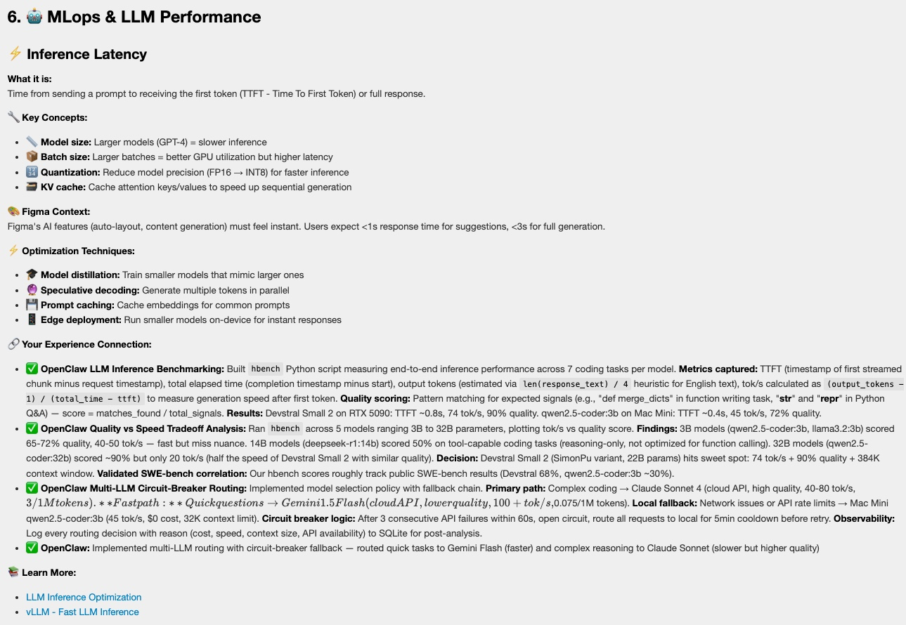
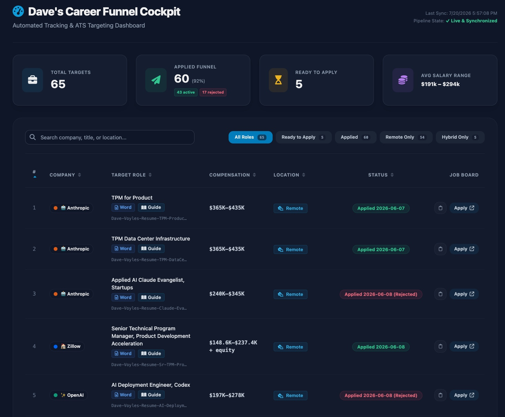

# 📄 Resume builder

[](https://github.com/DaveVoyles/resume-builder/actions/workflows/validate.yml)
[](LICENSE)


Your AI agent turns years of scattered work history into resumes that hold up under scrutiny,
applications that track themselves, and interview study guides that make you sound like *you*
actually did the work — because you did.

Free and open source, no API key required, updated daily. See [why it's free](#-why-this-is-free).

This project assumes you have a **terminal AI agent at all times** — GitHub Copilot CLI, Claude,
ChatGPT, or anything else that can read and edit files in your repo. The agent interviews you,
drafts resume content, and does the semantic work. The CLI is its deterministic toolbelt — no
LLM calls, no API key, and it validates, renders, tracks, and audits every claim against the
evidence you actually gave it. See
[ADR 0001: Agent-operated CLI](docs/decisions/0001-agent-operated-cli.md) for the full rationale.

You can also drive the CLI yourself without an agent — see
[CLI workflow](docs/cli-workflow.md) — but the docs and UX are written for the agent-first path.

## 🚀 Start here

Paste this to your terminal agent:

```text
Download https://github.com/DaveVoyles/resume-builder and help me get started. Run the sample
workflow first (npm start), then follow docs/playbooks/onboarding.md to set up my private
workspace and walk me through dropping my resumes, notes, and links into candidate/inputs/.
Ask clarifying questions before making resume claims.
```

Prefer to drive it yourself first?

```bash
npm install
npm start
```

`npm start` runs a fictional sample candidate through the **entire lifecycle** — tracker,
similar-role review, a rendered DOCX resume, a full `tailor` pass, a status update, and an
interview study-guide bundle — so you see every stage before touching real data. Nothing it
touches is real: the sample candidate ("Alex Rivera"), companies, and postings are fictional.

## 🎓 Study guides that make you sound like you already know the answer

This is the feature I built this whole project around, and it's the one candidates say hits
hardest.

Before an interview, one command gathers everything relevant to *this exact role* — your real
work history, your evidence ledger, the resume you tailored for this posting, and the job
description itself — into a single context bundle. Your agent then writes an interview study
guide from it: organized by topic, every talking point tied back to something you actually did.

<p align="center">
  
</p>

> "I go into interviews and meetings *much* more confident now, because I don't have to think
> back on 15 years of engineering work from the top of my head and come up with an answer on the
> spot. I just look at the guide and go — 'oh yeah, I *did* do that. Here's how.'"
> — Dave, using this on his own job search

It doesn't hand you generic interview tips. It looks at your actual work experience and the
projects you've built, and helps you (1) anticipate the kinds of problems and questions that'll
come up for a specific role, and (2) remember — with receipts — exactly how you've already
solved that problem in the real world.

```bash
npm run workspace:bundle -- --workspace candidate --company "Northwind Tools" --title "Senior Product Manager"
```

No API key, no re-scraping the job board — just the context you already built while tailoring
the resume, organized for the interview. Full playbook:
[`docs/playbooks/study-guide.md`](docs/playbooks/study-guide.md).

## 📊 It's actually working for me

This isn't a demo I mocked up — it's my own live application tracker, screenshotted mid-search:

<p align="center">
  
</p>

I've been shipping new features into this daily. I use it for my own search, every day, and it's
the reason I'm walking into interviews prepared instead of scrambling the night before.

## 🧭 The lifecycle

<p align="center">
  
</p>

| Stage | What happens | Playbook / command |
| --- | --- | --- |
| 1. Onboarding | Drop resumes, notes, and links into `candidate/inputs/` (or share a GitHub username); your agent ingests them. | [`docs/playbooks/onboarding.md`](docs/playbooks/onboarding.md) · `npm run workspace:ingest` |
| 2. Grill intake | The agent interviews you one question at a time — work history, target roles, location, compensation, constraints — and writes `profile.json`, `preferences.json`, `evidence.jsonl`. | [`docs/playbooks/grill.md`](docs/playbooks/grill.md) |
| 3. Find roles | The agent searches, vets postings against your preferences, verifies links are live, and maintains `leads.json`; you accept or skip each lead. | [`docs/playbooks/find-roles.md`](docs/playbooks/find-roles.md) |
| 4. Tailor | The agent drafts a resume config for one posting; `tailor` validates it, audits every claim against your evidence ledger, renders the DOCX, and tracks the role — all in one pass. Add `--cover-letter` for an evidence-audited cover letter alongside it. | [`docs/playbooks/tailor.md`](docs/playbooks/tailor.md) · `npm run workspace:tailor` |
| 5. Rendered DOCX | An evidence-backed resume (and optional cover letter) lands **un-applied**, so you review it first. | — |
| 6. Track | The role is registered in `roles.tracked.json`; `build-tracker` regenerates the markdown and HTML tracker. | `npm run workspace:tracker` |
| 7. Status updates | Tell your agent "I applied" / "I have an interview" / "I got rejected" — it runs `set-status` to record it and rebuild the tracker. | `npm run workspace:set-status` |
| 8. Study guide | `study-guide-bundle` gathers your profile, evidence, resume config, and the job posting into one context bundle; the agent writes the actual study guide from it. | [`docs/playbooks/study-guide.md`](docs/playbooks/study-guide.md) · `npm run workspace:bundle` |
| 9. Debrief | After an interview or practice session, the agent runs a Q&A debrief — capturing each question, your answer, and a proposed better answer for next time — into a private feedback ledger. | [`docs/playbooks/debrief.md`](docs/playbooks/debrief.md) |

Steps 4–8 repeat for every role you track; step 9 (debrief) can run any time, for any Q&A you
want to learn from. The CLI never calls an LLM — schema validation is the contract between what
your agent drafts and what the CLI is willing to write to disk or render.

**Contact tracking runs alongside this lifecycle, not as a numbered stage** — a referral,
recruiter, or former colleague can enter the picture before, during, or after any tracked role.
See the [contacts playbook](docs/playbooks/contacts.md).

Steps 1–8 were run end to end against the fictional sample candidate as part of shipping this
page, with real command output in [`docs/e2e-showcase.md`](docs/e2e-showcase.md).

## 🗺️ Every feature has a doc

Each stage is backed by an agent playbook (how to run it) and a reference doc (the file/schema
details):

| Feature | What it does | Agent playbook | Reference doc |
| --- | --- | --- | --- |
| Onboarding | State-aware first-run setup: workspace init, dropping in material, ingest, hand off to intake. | [`onboarding.md`](docs/playbooks/onboarding.md) | [Getting started](docs/getting-started.md) |
| Grill intake | One-question-at-a-time interview → `profile.json`, `preferences.json`, `evidence.jsonl`. | [`grill.md`](docs/playbooks/grill.md) | [Workspace schemas](docs/workspace-schemas.md#profilejson) |
| Find roles | Search, vet, and track prospective roles as leads before promoting them. | [`find-roles.md`](docs/playbooks/find-roles.md) | [Workspace schemas](docs/workspace-schemas.md#leadsjson) |
| Tailor | Draft a resume config, then validate, audit claims, render DOCX, and track — in one pass. | [`tailor.md`](docs/playbooks/tailor.md) | [Accuracy and claims](docs/accuracy-and-claims.md#evidence-backed-claim-audit-blocking) |
| Cover letter | Draft an evidence-audited cover letter alongside a resume (`tailor --cover-letter`) or standalone (`render-cover-letter`). | [`cover-letter.md`](docs/playbooks/cover-letter.md) | [Workspace schemas](docs/workspace-schemas.md#cover-letter-render-config-render-cover-letter) |
| Keyword scoring | Score how much of an agent-extracted keyword list a resume config covers. Advisory only. | [`tailor.md`](docs/playbooks/tailor.md#step-31a-keyword-coverage-advisory---keywords) · `npm run workspace:score-keywords` | [Workspace schemas](docs/workspace-schemas.md#keyword-list-input-score-keywords) |
| Gap analysis | Score keyword coverage, then classify gaps (presentation, weak evidence, adjacent skill, true gap) into actionable feedback. | [`gap-analysis.md`](docs/playbooks/gap-analysis.md) · `npm run workspace:score-keywords` · `npm run workspace:gap-report` | [Workspace schemas](docs/workspace-schemas.md#gap-classification-input-gap-report) |
| Status updates | Record an application status change — including `ghosted` — and auto-propose the next follow-up. | Recipe in [`AGENTS.md`](AGENTS.md#-status-update-recipe) | [Workspace schemas](docs/workspace-schemas.md#auto-generating-nextaction-on-status-transitions) |
| Study guide | Bundle profile, evidence, resume config, and job posting into interview prep. | [`study-guide.md`](docs/playbooks/study-guide.md) | [Workspace schemas](docs/workspace-schemas.md#study-guide-bundle-study-guide-bundle) |
| Debrief | Capture Q&A feedback and sentiment from interviews or practice sessions. | [`debrief.md`](docs/playbooks/debrief.md) | [Workspace schemas](docs/workspace-schemas.md#feedbackjsonl) |
| Contacts | Track your professional network independently of any specific tracked role. | [`contacts.md`](docs/playbooks/contacts.md) | [Workspace schemas](docs/workspace-schemas.md#contactsjson) |
| Tracker | Markdown + interactive HTML tracker — pipeline funnel, stale badges, `ghosted` status. | — | [Workspace schemas](docs/workspace-schemas.md#staleness-computation) |
| Style check | Advisory de-AI lint over resume/cover-letter text (buzzwords, sentence-uniformity, repetition) — never blocks. | Rewrite step in [`tailor.md`](docs/playbooks/tailor.md) | [`style-lint.md`](docs/style-lint.md) |
| Privacy & validation | Schema validation, evidence-backed claim audit, and privacy checks. | — | [Candidate workspace](docs/candidate-workspace.md) |

## 🤔 Why use this

Job searches get messy fast: dozens of tabs, a resume that drifts further from the truth with
every "polish" pass, and no record of *why* you claimed a skill or metric when an interviewer
asks you to defend it. This keeps the search structured and honest:

- **Claims stay backed by evidence.** `tailor` audits every metric claim against your evidence
  ledger before rendering anything — an unsupported claim blocks the render, not a silent pass.
- **Nothing leaks by accident.** Real resumes, notes, and application data are private by
  default and gitignored; only reusable code, docs, and a fictional sample are ever committed.
- **You're not locked into one AI vendor.** Any terminal agent can drive it — GitHub Copilot
  CLI, Claude, ChatGPT, or none at all. No OpenAI/Anthropic/GitHub API key required.
- **Applications stay organized without a spreadsheet.** One command regenerates a markdown
  tracker and an interactive, searchable HTML tracker from structured JSON.
- **A tailored resume never applies for you.** `tailor` always lands a new role at `interested`
  — not `applied` — so a human reviews the DOCX before anything is sent.

## 👥 Who it's for

Anyone running a multi-application job search who wants their resume claims and tracker to hold
up under scrutiny — especially candidates applying to several roles at once, working with an AI
assistant, or tired of maintaining tracker spreadsheets and resume versions by hand.

## 👀 See it in action

`npm start` builds the tracker, renders a resume, and tracks a role from the fictional sample
workspace. The interactive HTML tracker — searchable, filterable, with summary stat cards, a
pipeline funnel, and stale-application badges — looks like this:

<p align="center">
  
</p>

And a real generated DOCX resume, evidence-backed and rendered from the sample workspace:

<p align="center">
  
</p>

## 🎁 What this creates

- A private candidate workspace.
- An evidence ledger that ties resume claims back to source material.
- Evidence-backed, schema-validated **DOCX resumes** tailored per job posting.
- A markdown application tracker **and** an interactive HTML tracker.
- A `leads.json` of vetted, link-verified prospective roles.
- [Interview study-guide](docs/playbooks/study-guide.md) context bundles for tracked roles.
- [Q&A debrief](docs/playbooks/debrief.md) feedback for learning from interviews and practice
  sessions.
- Follow-up questions and strategy notes when you use an agent.

## 🔒 Privacy promise

Real candidate inputs and generated outputs are ignored by default. The included sample
candidate is fictional and safe to inspect.

Before sharing or pushing changes, run:

```bash
npm run check:privacy
```

## 📚 Learn more

| Need | Read |
| --- | --- |
| First-time setup | [Getting started](docs/getting-started.md) |
| Agent-assisted workflow | [Agent workflow](docs/agent-workflow.md) |
| Every playbook, run end to end (this page's regression pass) | [End-to-end showcase](docs/e2e-showcase.md) |
| Raw CLI reference (no agent) | [CLI workflow](docs/cli-workflow.md) |
| Workspace files and privacy | [Candidate workspace](docs/candidate-workspace.md) |
| Schema details | [Workspace schemas](docs/workspace-schemas.md) |
| Claim safety | [Accuracy and claims](docs/accuracy-and-claims.md) |
| Packaged agent instructions | [Playbooks](docs/playbooks/) |

## 🗂️ Repository layout

Every top-level folder has its own README explaining what it holds:

| Folder | What's there |
| --- | --- |
| [`docs/`](docs/) | Guides, ADRs, design plans, and images — everything linked from this page. |
| [`src/`](src/) | The reusable engine: CLI commands, core logic, renderers, adapters. |
| [`examples/`](examples/) | The fictional sample candidate workspace `npm start` runs against. |
| [`scripts/`](scripts/) | Standalone scripts behind `npm run check:*` and `npm start`. |
| [`templates/`](templates/) | Blank starter files scaffolded into a new candidate workspace. |
| [`tests/`](tests/) | Test suite, mirroring `src/`'s folder layout. |

## ✅ Requirements

- Node.js 16+ and npm. Node 18+ is recommended.
- Git for cloning the repo and running privacy checks.
- An AI assistant is optional, but recommended for non-technical users.

No OpenAI, Anthropic, or GitHub Copilot API key is required by the local CLI.

## 🤝 Join in

This is still moving fast — I'm shipping improvements to it daily. Three ways to make it better
for everyone:

- **Pull often.** Fixes and features land daily; `git pull` before a session to get them.
  ```bash
  git pull origin main
  ```
- **Tell me what you need.** If something's missing or clunky for your search, that's exactly
  what I want to hear — [open a feature request](https://github.com/DaveVoyles/resume-builder/issues/new).
- **Tell me when it works.** If this helped you land an interview or an offer, I want to know —
  and, with your permission, I'd love to point future users to your story. [Open an
  issue](https://github.com/DaveVoyles/resume-builder/issues/new) or reach out directly.

## 💛 Why this is free

I put a lot of hours into this every day, and I know people build and sell products like it.
I'm genuinely torn on that — people should get paid for their time, skill, and labor, and I don't
think less of anyone charging for a tool like this.

But I also know what it's like to watch a job search grind someone down, especially after a
layoff, when confidence is already the scarcest resource you have. I don't want cost to be one
more reason someone gives up before they get the interview they were qualified for. So this stays
free and open source.

It's also, honestly, a chance for me to show what I can build — the code, the docs, the design
decisions, all of it is here for anyone to look at. If that happens to help someone hiring or
looking to collaborate, that's a welcome side effect, not the point. The point is getting you to
your next interview more prepared than you'd be without it.

## 🙏 Acknowledgements

This project adopts several feature concepts from Scott Galloway's
[lucidRESUME](https://github.com/scottgal/lucidRESUME), released under the
Unlicense. Specific inspirations include the pipeline staleness-tracking model,
the gap taxonomy for surfacing actionable skills feedback, explicit
tailoring-quality passes (relevance compression and de-AI style review), and a
dashboard-feel visual refresh for the application tracker. lucidRESUME is a
polished, standalone desktop tool with its own architectural approach — if you're
exploring resume-building ideas, check it out directly. Thanks to Scott Galloway
for open-sourcing it.
