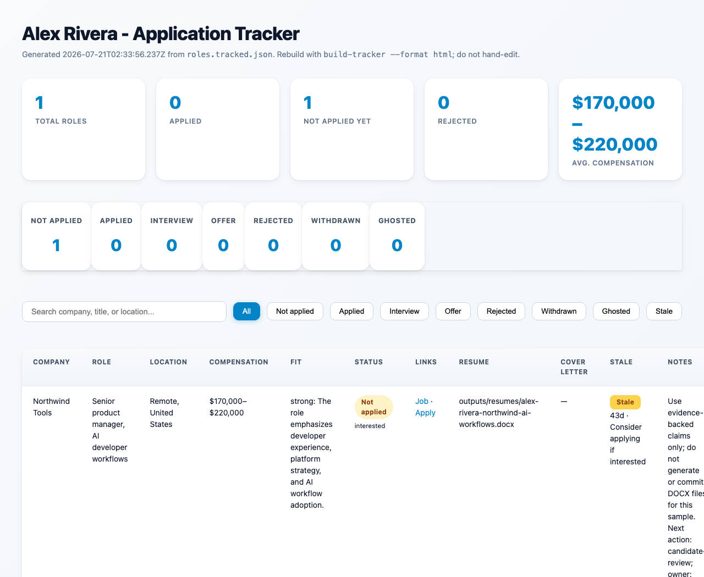
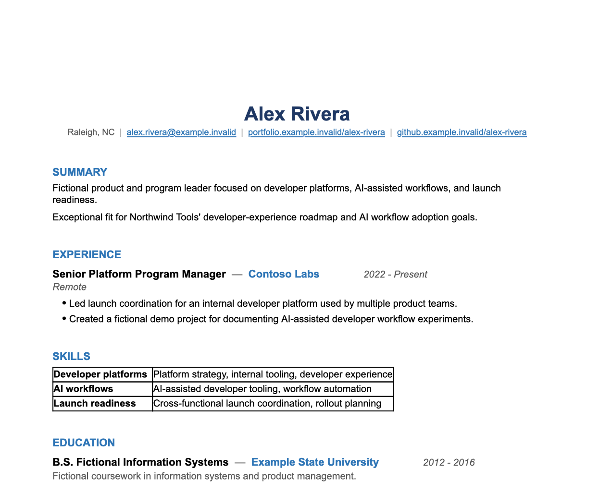

# 📄 Resume builder

[](https://github.com/DaveVoyles/resume-builder/actions/workflows/validate.yml)
[](LICENSE)


Evidence-backed resume workspace tooling for AI-assisted job searches — drop in your resumes,
notes, and links, let an agent interview you, find and vet roles, tailor an evidence-backed DOCX
resume per posting, and track every application without a spreadsheet.

This project assumes you have a **terminal AI agent at all times** — GitHub Copilot CLI, Claude,
ChatGPT, or anything else that can read and edit files in your repo. The agent is the primary
operator: it interviews you, drafts resume content, and does the semantic work. The CLI is the
agent's deterministic toolbelt — it never calls an LLM, requires no API key, and validates,
renders, tracks, and audits every claim against the evidence you actually gave it. See
[ADR 0001: Agent-operated CLI](docs/decisions/0001-agent-operated-cli.md) for the full rationale.

You can also run the CLI yourself without an agent — see
[CLI workflow](docs/cli-workflow.md) — but the docs and UX are written for the agent-first path.

## 🚀 Start here

Paste this to your terminal agent:

```text
Download https://github.com/DaveVoyles/resume-builder and help me get started. Run the sample
workflow first (npm start), then follow docs/playbooks/onboarding.md to set up my private
workspace and walk me through dropping my resumes, notes, and links into candidate/inputs/.
Ask clarifying questions before making resume claims.
```

Prefer to drive it yourself first?

```bash
npm install
npm start
```

`npm start` runs the fictional sample candidate through the **entire lifecycle** — tracker,
similar-role review, a rendered DOCX resume, a full `tailor` pass, a status update, and an
interview study-guide bundle — so you can see every stage before touching real data. Nothing it
touches is real: the sample candidate ("Alex Rivera"), companies, and postings are fictional.

## 🧭 The lifecycle

<p align="center">
  
</p>

| Stage | What happens | Playbook / command |
| --- | --- | --- |
| 1. Onboarding | You drop resumes, notes, and links into `candidate/inputs/` (or share a GitHub username); your agent ingests them. | [`docs/playbooks/onboarding.md`](docs/playbooks/onboarding.md) · `npm run workspace:ingest` |
| 2. Grill intake | The agent interviews you one question at a time — work history, target roles, location, compensation, constraints — and writes `profile.json`, `preferences.json`, `evidence.jsonl`. | [`docs/playbooks/grill.md`](docs/playbooks/grill.md) |
| 3. Find roles | The agent searches, vets postings against your preferences, verifies links are live, and maintains `leads.json`; you accept or skip each lead. | [`docs/playbooks/find-roles.md`](docs/playbooks/find-roles.md) |
| 4. Tailor | The agent drafts a resume config for one job posting; `tailor` validates it, audits every claim against your evidence ledger, renders the DOCX, and tracks the role — all in one pass. | [`docs/playbooks/tailor.md`](docs/playbooks/tailor.md) · `npm run workspace:tailor` |
| 5. Rendered DOCX | An evidence-backed resume lands at `outputs/resumes/<Company>/`, landed **un-applied** so you review it first. | — |
| 6. Track | The role is registered in `roles.tracked.json`; `build-tracker` regenerates the markdown and HTML tracker. | `npm run workspace:tracker` |
| 7. Status updates | Tell your agent "I applied" / "I have an interview" / "I got rejected" — it runs `set-status` to record the enum status and rebuild the tracker. | `npm run workspace:set-status` |
| 8. Study guide | Before an interview, `study-guide-bundle` gathers your profile, evidence, resume config, and the job posting into one context bundle; the agent writes the actual study guide from it. | [`docs/playbooks/study-guide.md`](docs/playbooks/study-guide.md) · `npm run workspace:bundle` |
| 9. Debrief | After an interview or practice session, the agent runs a Q&A debrief — capturing each question, your answer, sentiment, and a proposed better answer for next time — into a private feedback ledger. | [`docs/playbooks/debrief.md`](docs/playbooks/debrief.md) |

Steps 4–8 repeat for every role you track; step 9 (debrief) can run any time, for any Q&A you
want to learn from — a real interview, a practice session, or even a grill/tailor conversation.
The CLI never calls an LLM at any stage — schema validation is the contract between what your
agent drafts and what the CLI is willing to write to disk or render.

Steps 1–8 (onboarding through study guide) were run end to end against the fictional sample
candidate as part of shipping this page, with real command output captured in
[`docs/e2e-showcase.md`](docs/e2e-showcase.md) — that page is also the regression pass over each
playbook, and it names one bug it found and fixed along the way. Debrief shipped after that
regression pass and isn't in it yet.

## 🗺️ Every feature has a doc

Each stage above is backed by an agent playbook (the how-to-run-it instructions) and a reference
doc (the file/schema details) — so whether you're a human skimming for "how does this work" or
an agent looking for the exact contract, there's one place to look:

| Feature | What it does | Agent playbook | Reference doc |
| --- | --- | --- | --- |
| Onboarding | State-aware first-run setup: workspace init, dropping in material, ingest, hand off to intake. | [`onboarding.md`](docs/playbooks/onboarding.md) | [Getting started](docs/getting-started.md) |
| Grill intake | One-question-at-a-time interview → `profile.json`, `preferences.json`, `evidence.jsonl`. | [`grill.md`](docs/playbooks/grill.md) | [Workspace schemas](docs/workspace-schemas.md#profilejson) |
| Find roles | Search, vet, and track prospective roles as leads before promoting them. | [`find-roles.md`](docs/playbooks/find-roles.md) | [Workspace schemas](docs/workspace-schemas.md#leadsjson) |
| Tailor | Draft a resume config, then validate, audit claims, render DOCX, and track — in one pass. | [`tailor.md`](docs/playbooks/tailor.md) | [Accuracy and claims](docs/accuracy-and-claims.md#evidence-backed-claim-audit-blocking) |
| Gap analysis | Score keyword coverage in a resume, then classify missing keywords by gap type (presentation, weak evidence, adjacent skill, true gap) and generate actionable feedback. | [`gap-analysis.md`](docs/playbooks/gap-analysis.md) · `npm run workspace:score-keywords` · `npm run workspace:gap-report` | [Workspace schemas](docs/workspace-schemas.md#gap-classification-input-gap-report) |
| Status updates | Record an application status change — including `ghosted`, for roles that went silent — and auto-propose the next follow-up. | Recipe in [`AGENTS.md`](AGENTS.md#-status-update-recipe) | [Workspace schemas](docs/workspace-schemas.md#auto-generating-nextaction-on-status-transitions) |
| Study guide | Bundle profile, evidence, resume config, and job posting into interview prep. | [`study-guide.md`](docs/playbooks/study-guide.md) | [Workspace schemas](docs/workspace-schemas.md#study-guide-bundle-study-guide-bundle) |
| Debrief | Capture Q&A feedback and sentiment from interviews or practice sessions. | [`debrief.md`](docs/playbooks/debrief.md) | [Workspace schemas](docs/workspace-schemas.md#feedbackjsonl) |
| Tracker | Markdown + interactive HTML application tracker, generated from tracked roles — pipeline funnel, per-role stale badges, and a `ghosted` status for roles that went silent. | — | [Workspace schemas](docs/workspace-schemas.md#staleness-computation) |
| Style check | Advisory de-AI lint over resume/cover-letter text (buzzwords, sentence-uniformity, repetition) from `tailor` and `validate` — never blocks. | Rewrite step in [`tailor.md`](docs/playbooks/tailor.md) | [`style-lint.md`](docs/style-lint.md) |
| Privacy & validation | Schema validation, evidence-backed claim audit, and privacy checks. | — | [Candidate workspace](docs/candidate-workspace.md) |

## 🎓 Walk into interviews prepared

Before an interview for a tracked role, one command gathers everything relevant — your profile,
your evidence ledger, the resume you tailored for *this exact posting*, and the job posting
itself — into a single context bundle:

```bash
npm run workspace:bundle -- --workspace candidate --company "Northwind Tools" --title "Senior Product Manager"
```

From that bundle, your agent writes an interview study guide that:

- **Organizes by interview stage** — recruiter screen, team interviews, executive round — not a
  generic list of tips.
- **Grounds every talking point in evidence.** Each achievement links back to an
  `evidence.jsonl` entry ID, so you can defend it under a follow-up question instead of
  improvising.
- **Prepares you for gaps honestly.** A dedicated "Addressing Gaps" section drafts a short,
  honest response for skills the posting wants that your evidence doesn't yet cover — no getting
  caught flat-footed.
- **Gives you a day-of checklist** — confirm timing and format, note who you're meeting, bring a
  physical copy of the resume you actually tailored for this role.

No API key, no scraping the job board again — just the context you already built while
tailoring the resume, organized for the interview. See
[`docs/playbooks/study-guide.md`](docs/playbooks/study-guide.md) for the full playbook, or
[`docs/e2e-showcase.md`](docs/e2e-showcase.md#4-study-guide--docsplaybooksstudy-guidemd) for a
real bundle generated end to end against the fictional sample candidate.

## 🤔 Why use this

Job searches get messy fast: dozens of tabs, a resume that drifts further from the truth with
every "polish" pass, and no record of *why* you claimed a skill or metric when an interviewer
asks you to defend it. This project keeps the search structured and honest:

- **Claims stay backed by evidence.** `tailor` audits every metric claim in a resume config
  against your evidence ledger before it renders anything — an unsupported claim blocks the
  render with a per-claim error, not a silent pass.
- **Nothing leaks by accident.** Real resumes, notes, and application data are private by
  default and gitignored; only reusable code, docs, and a fictional sample are ever committed.
- **You're not locked into one AI vendor.** It's a plain Node.js CLI that any terminal agent
  (GitHub Copilot CLI, Claude, ChatGPT, or none at all) can drive. No OpenAI/Anthropic/GitHub API
  key required.
- **Applications stay organized without a spreadsheet.** One command regenerates a markdown
  tracker and an interactive, searchable HTML tracker straight from structured JSON.
- **A tailored resume never applies for you.** `tailor` always lands a new role at `interested`
  — not `applied` — so a human reviews the DOCX before anything is sent.

## 👥 Who it's for

Anyone running a multi-application job search who wants their resume claims and tracker to hold
up under scrutiny — especially candidates applying to several roles at once, working with an AI
assistant, or anyone tired of maintaining tracker spreadsheets and resume versions by hand.

## 👀 See it in action

Running `npm start` builds the tracker, renders a resume, and tracks a role from the fictional
sample workspace. The interactive HTML tracker (`npm run workspace:tracker -- --workspace
<dir> --format html`) — searchable, filterable, with summary stat cards, a pipeline funnel, and
stale-application badges — looks like this:

<p align="center">
  
</p>

And the resume `tailor`/`render-resume` produces — a real generated DOCX, evidence-backed and
rendered from the sample workspace's resume config — looks like this:

<p align="center">
  
</p>

The markdown tracker (`npm run workspace:tracker`) is the same data as plain text:

```markdown
# Application Tracker

| Company | Role | Location | Compensation | Fit | Applied | Job URL | Apply URL | Resume | Notes |
| --- | --- | --- | --- | --- | --- | --- | --- | --- | --- |
| Northwind Tools | Senior product manager, AI developer workflows | Remote, United States | $170,000–$220,000 | strong: ... | interested | [Job](...) | [Apply](...) | outputs/resumes/... | ... |
```

## 🎁 What this creates

- A private candidate workspace.
- An evidence ledger that ties resume claims back to source material.
- Evidence-backed, schema-validated **DOCX resumes** tailored per job posting.
- A markdown application tracker **and** an interactive HTML tracker.
- A `leads.json` of vetted, link-verified prospective roles.
- [Interview study-guide](docs/playbooks/study-guide.md) context bundles for tracked roles.
- [Q&A debrief](docs/playbooks/debrief.md) feedback for learning from interviews and practice
  sessions.
- Follow-up questions and strategy notes when you use an agent.

## 🔒 Privacy promise

Real candidate inputs and generated outputs are ignored by default. The included sample
candidate is fictional and safe to inspect.

Before sharing or pushing changes, run:

```bash
npm run check:privacy
```

## 📚 Learn more

| Need | Read |
| --- | --- |
| First-time setup | [Getting started](docs/getting-started.md) |
| Agent-assisted workflow | [Agent workflow](docs/agent-workflow.md) |
| Every playbook, run end to end (this page's regression pass) | [End-to-end showcase](docs/e2e-showcase.md) |
| Raw CLI reference (no agent) | [CLI workflow](docs/cli-workflow.md) |
| Workspace files and privacy | [Candidate workspace](docs/candidate-workspace.md) |
| Schema details | [Workspace schemas](docs/workspace-schemas.md) |
| Claim safety | [Accuracy and claims](docs/accuracy-and-claims.md) |
| Packaged agent instructions | [Playbooks](docs/playbooks/) |

## 🗂️ Repository layout

Every top-level folder has its own README explaining what it holds and how its subfolders are
organized — useful whether you're a human browsing the repo or an agent navigating it:

| Folder | What's there |
| --- | --- |
| [`docs/`](docs/) | Guides, ADRs, design plans, and images — everything linked from this page. |
| [`src/`](src/) | The reusable engine: CLI commands, core logic, renderers, adapters. |
| [`examples/`](examples/) | The fictional sample candidate workspace `npm start` runs against. |
| [`scripts/`](scripts/) | Standalone scripts behind `npm run check:*` and `npm start`. |
| [`templates/`](templates/) | Blank starter files scaffolded into a new candidate workspace. |
| [`tests/`](tests/) | Test suite, mirroring `src/`'s folder layout. |

## ✅ Requirements

- Node.js 16+ and npm. Node 18+ is recommended.
- Git for cloning the repo and running privacy checks.
- An AI assistant is optional, but recommended for non-technical users.

No OpenAI, Anthropic, or GitHub Copilot API key is required by the local CLI.

## 🙏 Acknowledgements

This project adopts several feature concepts from Scott Galloway's
[lucidRESUME](https://github.com/scottgal/lucidRESUME), released under the
Unlicense. Specific inspirations include the pipeline staleness-tracking model,
the gap taxonomy for surfacing actionable skills feedback, explicit
tailoring-quality passes (relevance compression and de-AI style review), and a
dashboard-feel visual refresh for the application tracker. lucidRESUME is a
polished, standalone desktop tool with its own architectural approach — if you're
exploring resume-building ideas, check it out directly. Thanks to Scott Galloway
for open-sourcing it.
