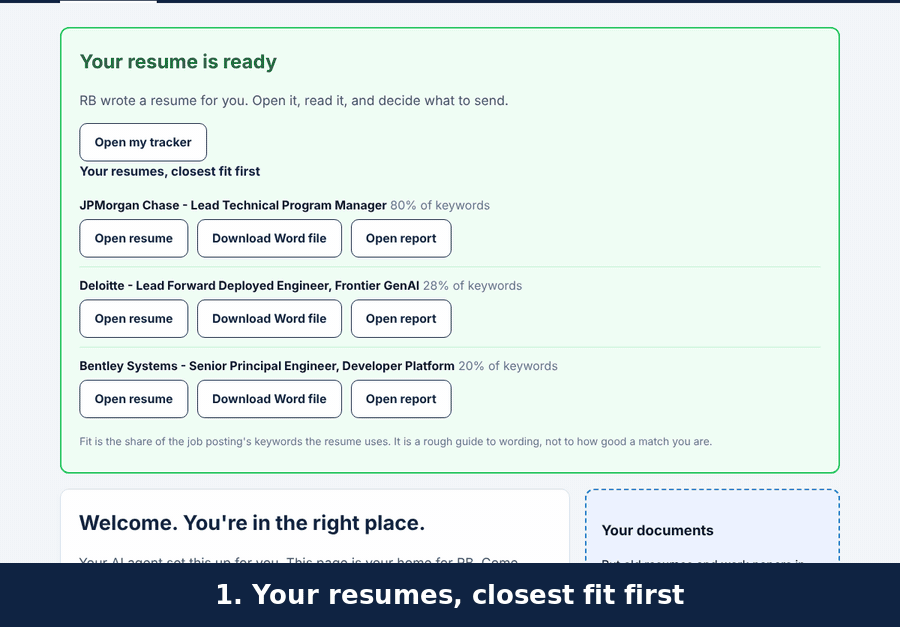
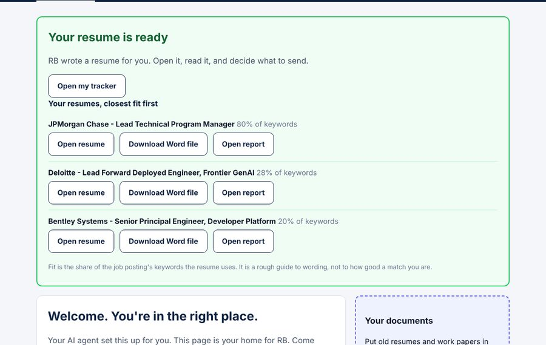
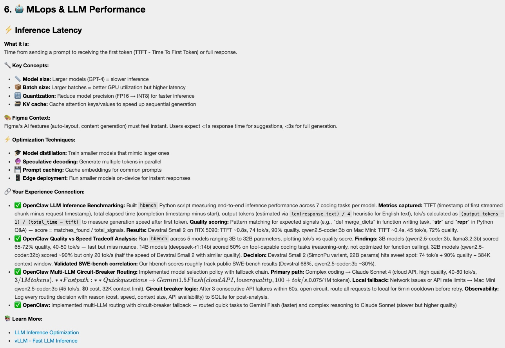
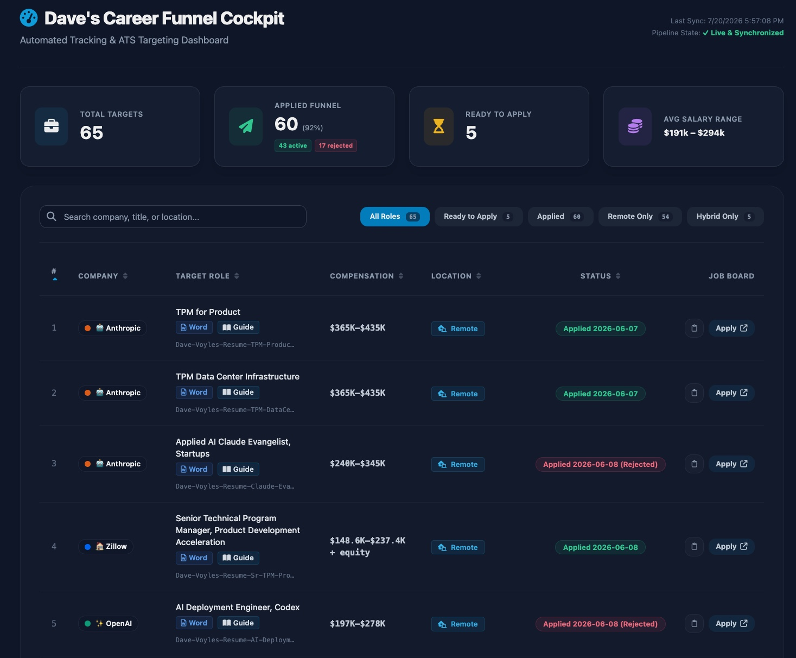
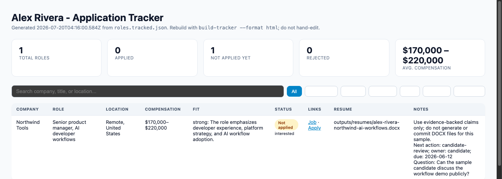
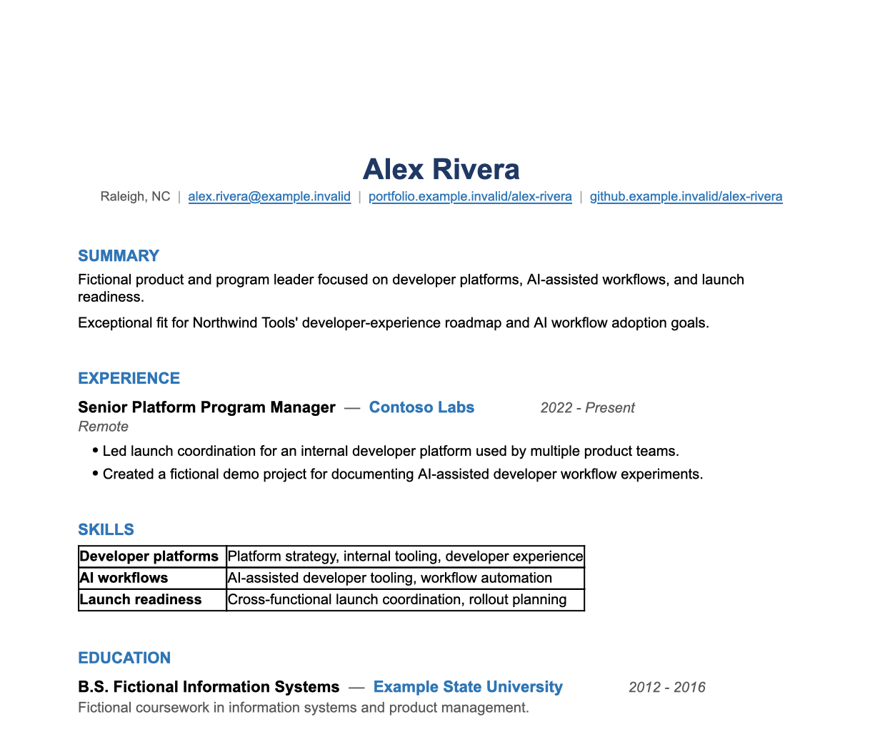

# 📄 Resume builder

[](https://github.com/DaveVoyles/resume-builder/actions/workflows/validate.yml)
[](LICENSE)


**[🎨 View live demo](https://DaveVoyles.github.io/resume-builder/)** — an interactive tracker
dashboard generated by the real renderer, using fictional placeholder data for a fictional
candidate ("Troy McClure"). Not Dave's real job search.

**[📸 See a real resume tailored for three real jobs](docs/showcase/README.md)**: the repo owner's own
resume, three saved job postings, and a step-by-step walk with screenshots. It shows the
before and after, and what the tool refuses to claim. Nothing is applied for.

## Pick your path

| You are | Start here |
| --- | --- |
| **A job seeker** (no coding needed) | [Start here if you are a person](#start-here-if-you-are-a-person). Paste one message to an AI assistant. |
| **An AI assistant** setting this up for someone | [For agents](#for-agents), then [`AGENTS.md`](AGENTS.md) and [`docs/first-run/FAQ.md`](docs/first-run/FAQ.md) |
| **A developer** extending or testing the tool | [For developers](#for-developers), then [Testing with personas](docs/testing.md) |
| **Just looking** | The [live demo](https://DaveVoyles.github.io/resume-builder/), the [tour below](#what-you-get) or the [showcase](docs/showcase/README.md) |

## What you get

Give it your old resume and a few job postings. For each job you get a one-page resume reworded for that posting, a plain-language report that proves what changed, and a tracker that holds every role. Everything it says about you traces back to your own words, and it never applies for you.

<p align="center">
  
</p>

*The tour above is a real run with the repo owner's own resume and three real job postings. Full walk with screenshots: [the showcase](docs/showcase/README.md).*

| You give it | You get back |
| --- | --- |
| Your old resumes, notes and a short About-you form | A private workspace and an **evidence ledger**: one entry per resume bullet or note, each with an id. Nothing gets said about you without one. |
| A job posting (saved text or a link) | The posting's keywords, a **one-page DOCX resume** for that job, and an optional evidence-audited cover letter |
| (nothing extra) | A **tailor report** (HTML for you, Markdown for your agent): your general resume next to the tailored one, a "why" and a source for every edit, what was left out, and the keyword coverage before and after |
| Yes or no answers | **Possible matches**: keywords your resume says in other words. The tool shows the closest lines and asks. It never adds one on its own. |
| Keywords you have not done | A **declined list**. Those words stay off every resume and a check fails if one appears. |
| Roles you are scouting | A `leads.json` of vetted, link-verified roles. You accept or skip each one before it is tracked. |
| Several jobs | A home page that lists every resume **closest fit first**, plus a searchable tracker with a pipeline funnel and stale-application badges |
| An interview coming up | A [study-guide bundle](docs/playbooks/study-guide.md) for that role and a [Q&A debrief](docs/playbooks/debrief.md) afterwards |

<p align="center">
  
</p>

### Guardrails you can count on

- **Evidence first.** Every number is checked against your own record. An unsupported claim blocks the render. Employers, titles and dates are checked against your profile too.
- **Honest by design.** Declined keywords, a "needs your confirmation" list, and a "left out" list show what the tool would not say.
- **One page.** The page count is checked after rendering when LibreOffice is installed.
- **Private by default.** Real files, answers and outputs live in a gitignored workspace. `npm run check:privacy` guards every push.
- **No submit path.** Nothing in this project can send an application. `apply` only supports `--dry-run`, and tests fail if a submit path appears.
- **No AI key.** The CLI never calls a model. Your assistant does the drafting; the CLI validates and renders.

## Start here if you are a person

You do not need to code, but **you do need an AI assistant**. It is required, not optional. The assistant is the one that interviews you, reads your old resumes, drafts each tailored resume, and runs the commands. This program only checks, audits and renders what the assistant writes: it does not call an AI itself, so without an assistant nothing writes your resume.

Any assistant that can work on your computer will do. Claude, Grok, or Gemini (Google Antigravity counts) all work. Copilot or ChatGPT also work. You need no API key for this program.

You talk. The assistant does the computer work.

Paste this to your assistant:

```text
Clone https://github.com/DaveVoyles/resume-builder and help me get started.
Open docs/first-run/guide.html in my browser first and walk me through it.
Then follow docs/first-run/FAQ.md. Ask me questions before you write any claim about me.
Do not ask me to run commands.
```

Your assistant will open a one-page briefing: a private profile built from your own material, a resume written for one role you approve, a list that can hold several roles, and a brief before an interview.

The page is also here: [docs/first-run/guide.html](docs/first-run/guide.html).

**What you will see:** the three-tab home page (Introduction, FAQ, Jobs) opens at http://localhost:4321. Your files go in `my-documents/`, drafts appear in `output/`, and "Open my tracker" on the home page opens the tracker. Your files stay on your computer and are not published with this project.

Free and open source, no API key required. See [why it's free](#-why-this-is-free).

## For agents

You operate the CLI. The person decides what is true and when anything is sent. Read these in order:

1. [`AGENTS.md`](AGENTS.md): your rules (claims, privacy, communication, merging).
2. [`docs/first-run/FAQ.md`](docs/first-run/FAQ.md): the script from an empty folder to a resume, a job list and a study guide. Say only what is in [`what-to-say.md`](docs/first-run/what-to-say.md).
3. [`docs/playbooks/`](docs/playbooks/): one playbook per stage. [`onboarding.md`](docs/playbooks/onboarding.md) tells you which step the person is on.

Commands you will use most (run from the repo root; the workspace is `candidate`):

| Task | Command |
| --- | --- |
| Install and open the home page | `npm install`, `npm run home` |
| Read in their files | `npm run workspace:ingest -- --workspace candidate` |
| Pending "Add a job" requests | `npm run workspace:job-requests -- --workspace candidate list` |
| Add a role from a posting | `npm run workspace:add-role -- --workspace candidate ...` |
| Validate, audit, render, track | `npm run workspace:tailor -- --workspace candidate ...` |
| Why each edit was made | `npm run workspace:tailor-report -- --workspace candidate ...` |
| Record "I applied / interview / rejected" | `npm run workspace -- set-status --workspace candidate ...` |
| Check before handoff or commit | `npm run workspace:validate -- --workspace candidate`, `npm run check:privacy` |

Hard rules, in short:

- **Never submit an application** or pass `--confirm-submit`. Submission is out of scope everywhere, including tests.
- **Never invent a claim.** Ask first. The evidence ledger is the source of truth, and the render is blocked on an unsupported number.
- **Do not ask the person to run commands or edit files.** Tell them the result and the real path.
- **`candidate/` is private.** Never commit it. Only code, docs, templates and fictional examples are committed.

## For developers

`npm install` then `npm start` runs the fictional sample (Alex Rivera) through the whole lifecycle in a temporary folder and deletes it. It is a practice run, not the first page for a person. Then `npm run setup` creates your own private workspace.

```bash
npm install
npm start          # practice sample, nothing is kept
npm test           # unit and CLI tests
npm run validate   # schema, claims and privacy checks
npm run e2e        # persona scorecards (nothing is submitted)
```

The CLI is built for an assistant to operate, so running it by hand is for testing and extending the tool. See the [CLI workflow](docs/cli-workflow.md), [ADR 0001](docs/decisions/0001-agent-operated-cli.md) and [Testing with personas](docs/testing.md).

## 🎓 Study guides that make you sound like you already know the answer

This is the feature I built this whole project around, and it's the one candidates say hits
hardest.

Before an interview, one command gathers everything relevant to *this exact role* — your real
work history, your evidence ledger, the resume you tailored for this posting, and the job
description itself — into a single context bundle. Your agent then writes an interview study
guide from it: organized by topic, every talking point tied back to something you actually did.

<p align="center">
  
</p>

> "I go into interviews and meetings *much* more confident now, because I don't have to think
> back on 15 years of engineering work from the top of my head and come up with an answer on the
> spot. I just look at the guide and go — 'oh yeah, I *did* do that. Here's how.'"
> — Dave, using this on his own job search

It doesn't hand you generic interview tips. It looks at your actual work experience and the
projects you've built, and helps you (1) anticipate the kinds of problems and questions that'll
come up for a specific role, and (2) remember — with receipts — exactly how you've already
solved that problem in the real world.

Ask your assistant for a study guide before the interview. Your assistant gathers your history, the resume, and the job posting, then writes the guide. You do not run a command.

No API key, no re-scraping the job board — just the context you already built while tailoring
the resume, organized for the interview. Full playbook:
[`docs/playbooks/study-guide.md`](docs/playbooks/study-guide.md).

## 📊 It's actually working for me

This isn't a demo I mocked up — it's my own live application tracker, screenshotted mid-search:

<p align="center">
  
</p>

I've been shipping new features into this daily. I use it for my own search, every day, and it's
the reason I'm walking into interviews prepared instead of scrambling the night before.

## 🧭 The lifecycle

<p align="center">
  
</p>

| Stage | What happens | Playbook / command |
| --- | --- | --- |
| 1. Onboarding | You put resumes and notes in `my-documents` (or share a GitHub username). The agent copies them into `candidate/inputs/resumes` and `candidate/inputs/notes`, writes `candidate/inputs/links.md`, and ingests them. | [`docs/playbooks/onboarding.md`](docs/playbooks/onboarding.md) · `npm run workspace:ingest` |
| 2. Grill intake | The agent interviews you one question at a time — work history, target roles, location, compensation, constraints — and writes `profile.json`, `preferences.json`, `evidence.jsonl`. | [`docs/playbooks/grill.md`](docs/playbooks/grill.md) |
| 3. Find roles | The agent searches, vets postings against your preferences, verifies links are live, and maintains `leads.json`; you accept or skip each lead. | [`docs/playbooks/find-roles.md`](docs/playbooks/find-roles.md) |
| 4. Tailor | The agent drafts a resume config for one posting; `tailor` validates it, audits every claim against your evidence ledger, renders the DOCX, and tracks the role — all in one pass. Add `--cover-letter` for an evidence-audited cover letter alongside it. | [`docs/playbooks/tailor.md`](docs/playbooks/tailor.md) · `npm run workspace:tailor` |
| 5. Rendered DOCX | An evidence-backed resume (and optional cover letter) lands **un-applied**, so you review it first. | — |
| 6. Track | The role is registered in `roles.tracked.json`; `build-tracker` regenerates the markdown and HTML tracker. | `npm run workspace:tracker` |
| 7. Status updates | Tell your agent "I applied" / "I have an interview" / "I got rejected" — it runs `set-status` to record it and rebuild the tracker. | `npm run workspace:set-status` |
| 8. Study guide | `study-guide-bundle` gathers your profile, evidence, resume config, and the job posting into one context bundle; the agent writes the actual study guide from it. | [`docs/playbooks/study-guide.md`](docs/playbooks/study-guide.md) · `npm run workspace:bundle` |
| 9. Debrief | After an interview or practice session, the agent runs a Q&A debrief — capturing each question, your answer, and a proposed better answer for next time — into a private feedback ledger. | [`docs/playbooks/debrief.md`](docs/playbooks/debrief.md) |

Steps 4–8 repeat for every role you track; step 9 (debrief) can run any time, for any Q&A you
want to learn from. The CLI never calls an LLM — schema validation is the contract between what
your agent drafts and what the CLI is willing to write to disk or render.

**Contact tracking runs alongside this lifecycle, not as a numbered stage** — a referral,
recruiter, or former colleague can enter the picture before, during, or after any tracked role.
See the [contacts playbook](docs/playbooks/contacts.md).

Steps 1–8 were run end to end against the fictional sample candidate as part of shipping this
page, with real command output in [`docs/e2e-showcase.md`](docs/e2e-showcase.md).

## 🗺️ Every feature has a doc

Each stage is backed by an agent playbook (how to run it) and a reference doc (the file/schema
details):

| Feature | What it does | Agent playbook | Reference doc |
| --- | --- | --- | --- |
| Onboarding | State-aware first-run setup: workspace init, dropping in material, ingest, hand off to intake. | [`onboarding.md`](docs/playbooks/onboarding.md) | [Getting started](docs/getting-started.md) |
| Grill intake | One-question-at-a-time interview → `profile.json`, `preferences.json`, `evidence.jsonl`. | [`grill.md`](docs/playbooks/grill.md) | [Workspace schemas](docs/workspace-schemas.md#profilejson) |
| Find roles | Search, vet, and track prospective roles as leads before promoting them. | [`find-roles.md`](docs/playbooks/find-roles.md) | [Workspace schemas](docs/workspace-schemas.md#leadsjson) |
| Tailor | Draft a resume config, then validate, audit claims, render DOCX, and track — in one pass. | [`tailor.md`](docs/playbooks/tailor.md) | [Accuracy and claims](docs/accuracy-and-claims.md#evidence-backed-claim-audit-blocking) |
| Cover letter | Draft an evidence-audited cover letter alongside a resume (`tailor --cover-letter`) or standalone (`render-cover-letter`). | [`cover-letter.md`](docs/playbooks/cover-letter.md) | [Workspace schemas](docs/workspace-schemas.md#cover-letter-render-config-render-cover-letter) |
| Tailor report | HTML and Markdown report: before and after for every edit, why, what backs it, what was left out, and coverage against your general resume. | `npm run workspace:tailor-report` · [`tailor.md`](docs/playbooks/tailor.md) | [Workspace schemas](docs/workspace-schemas.md) |
| Possible matches and confirmations | Keywords your resume says in other words. You answer yes or no; answers are saved as a note in your words and re-used on every later resume. | [`tailor.md`](docs/playbooks/tailor.md#step-32c-record-the-persons-yesno-answers-then-re-ingest-and-re-tailor) | [Accuracy and claims](docs/accuracy-and-claims.md) |
| Declined keywords | Keywords you have not done stay off every resume; the render is blocked if one appears. | [`tailor.md`](docs/playbooks/tailor.md) | [Accuracy and claims](docs/accuracy-and-claims.md) |
| Tailor plan | Rank your evidence against a posting's keywords before drafting. | `npm run workspace:tailor-plan` · [`tailor.md`](docs/playbooks/tailor.md) | [Workspace schemas](docs/workspace-schemas.md) |
| Home page and job requests | Three-tab page with your answers, every resume closest fit first, and an "Add a job" box that saves a request for your agent. | `npm run home` · `npm run workspace:job-requests` | [Getting started](docs/getting-started.md) |
| Persona tests | Scorecard, golden text and browser tests on four personas, including a real resume with real job snapshots. | `npm run e2e` | [Testing with personas](docs/testing.md) |
| Keyword scoring | Score how much of an agent-extracted keyword list a resume config covers. Advisory only. | [`tailor.md`](docs/playbooks/tailor.md#step-31a-keyword-coverage-advisory---keywords) · `npm run workspace:score-keywords` | [Workspace schemas](docs/workspace-schemas.md#keyword-list-input-score-keywords) |
| Gap analysis | Score keyword coverage, then classify gaps (presentation, weak evidence, adjacent skill, true gap) into actionable feedback. | [`gap-analysis.md`](docs/playbooks/gap-analysis.md) · `npm run workspace:score-keywords` · `npm run workspace:gap-report` | [Workspace schemas](docs/workspace-schemas.md#gap-classification-input-gap-report) |
| Status updates | Record an application status change — including `ghosted` — and auto-propose the next follow-up. | Recipe in [`AGENTS.md`](AGENTS.md#-status-update-recipe) | [Workspace schemas](docs/workspace-schemas.md#auto-generating-nextaction-on-status-transitions) |
| Study guide | Bundle profile, evidence, resume config, and job posting into interview prep. | [`study-guide.md`](docs/playbooks/study-guide.md) | [Workspace schemas](docs/workspace-schemas.md#study-guide-bundle-study-guide-bundle) |
| Debrief | Capture Q&A feedback and sentiment from interviews or practice sessions. | [`debrief.md`](docs/playbooks/debrief.md) | [Workspace schemas](docs/workspace-schemas.md#feedbackjsonl) |
| Contacts | Track your professional network independently of any specific tracked role. | [`contacts.md`](docs/playbooks/contacts.md) | [Workspace schemas](docs/workspace-schemas.md#contactsjson) |
| Tracker | Markdown + interactive HTML tracker — pipeline funnel, stale badges, `ghosted` status. | — | [Workspace schemas](docs/workspace-schemas.md#staleness-computation) |
| Style check | Advisory de-AI lint over resume/cover-letter text (buzzwords, sentence-uniformity, repetition) — never blocks. | Rewrite step in [`tailor.md`](docs/playbooks/tailor.md) | [`style-lint.md`](docs/style-lint.md) |
| Privacy & validation | Schema validation, evidence-backed claim audit, and privacy checks. | — | [Candidate workspace](docs/candidate-workspace.md) |

## 🧪 How we know it works

Every change is measured on the same people, so the experience is checked end to end each time:

- **Four test personas** (three fictional, one real: the repo owner, with permission) go from an empty folder to tailored resumes with `npm run e2e -- --persona owner`. It prints a scorecard: setup reaches done, claim audit passes, keyword coverage meets a per-job threshold, one page, no absolute paths in output, and no application submitted.
- **Golden resume text** per persona and job fails the build if a resume changes without review.
- **Real job snapshots.** The owner persona uses three saved job postings (text and screenshot), so the demo still works after the pages come down.
- **Browser tests** drive the home page with Playwright (`npm run test:browser`, Node 20+). `npm test` runs 1,000+ unit and CLI tests.
- **No-submit guard.** Tests fail if anything in `src/` can submit an application.

Details: [Testing with personas](docs/testing.md). A walk with screenshots: [the showcase](docs/showcase/README.md).

## 🤔 Why use this

Job searches get messy fast: dozens of tabs, a resume that drifts further from the truth with
every "polish" pass, and no record of *why* you claimed a skill or metric when an interviewer
asks you to defend it. This keeps the search structured and honest:

- **Claims stay backed by evidence.** `tailor` audits every metric claim against your evidence
  ledger before rendering anything — an unsupported claim blocks the render, not a silent pass.
- **Nothing leaks by accident.** Real resumes, notes, and application data are private by
  default and gitignored; only reusable code, docs, and a fictional sample are ever committed.
- **You're not locked into one AI vendor.** Any terminal agent can drive it — GitHub Copilot
  CLI, Claude, ChatGPT, Grok or Gemini. You do need one, but no OpenAI/Anthropic/GitHub API key
  is required by this program.
- **Applications stay organized without a spreadsheet.** One command regenerates a markdown
  tracker and an interactive, searchable HTML tracker from structured JSON.
- **A tailored resume never applies for you.** `tailor` always lands a new role at `interested`
  — not `applied` — so a human reviews the DOCX before anything is sent.

## 👥 Who it's for

Anyone running a multi-application job search who wants their resume claims and tracker to hold
up under scrutiny — especially candidates applying to several roles at once, working with an AI
assistant, or tired of maintaining tracker spreadsheets and resume versions by hand.

## 👀 See it in action

`npm start` builds the tracker, renders a resume, and tracks a role from the fictional sample
workspace. The interactive HTML tracker — searchable, filterable, with summary stat cards, a
pipeline funnel, and stale-application badges — looks like this:

<p align="center">
  
</p>

And a real generated DOCX resume, evidence-backed and rendered from the sample workspace:

<p align="center">
  
</p>

## 🔒 Privacy promise

Real candidate inputs and generated outputs are ignored by default. The included sample
candidate is fictional and safe to inspect. The one real resume in this repo is the owner's own,
shared on purpose with the email and phone scrubbed (`examples/real-resume/owner/`); it is the
only exception.

Before sharing or pushing changes, run:

```bash
npm run check:privacy
```

## 📚 Learn more

| Need | Read |
| --- | --- |
| First-time setup | [Getting started](docs/getting-started.md) |
| Agent-assisted workflow | [Agent workflow](docs/agent-workflow.md) |
| Every playbook, run end to end (this page's regression pass) | [End-to-end showcase](docs/e2e-showcase.md) |
| Raw CLI reference (no agent) | [CLI workflow](docs/cli-workflow.md) |
| Workspace files and privacy | [Candidate workspace](docs/candidate-workspace.md) |
| Schema details | [Workspace schemas](docs/workspace-schemas.md) |
| Claim safety | [Accuracy and claims](docs/accuracy-and-claims.md) |
| Packaged agent instructions | [Playbooks](docs/playbooks/) |

## 🗂️ Repository layout

Every top-level folder has its own README explaining what it holds:

| Folder | What's there |
| --- | --- |
| [`docs/`](docs/) | Guides, ADRs, design plans, and images — everything linked from this page. |
| [`src/`](src/) | The reusable engine: CLI commands, core logic, renderers, adapters. |
| [`examples/`](examples/) | The fictional sample candidate `npm start` runs against, test personas, and the owner's real resume (`examples/real-resume/`) used in the [showcase](docs/showcase/README.md). |
| [`scripts/`](scripts/) | Standalone scripts behind `npm run check:*` and `npm start`. |
| [`templates/`](templates/) | Blank starter files scaffolded into a new candidate workspace. |
| [`tests/`](tests/) | Test suite, mirroring `src/`'s folder layout. |
| [`onboarding/`](onboarding/) | The public three-tab home page served by `npm run home`. |
| [`my-documents/`](my-documents/) | Where you put resumes and notes. Starts with two sample files. |
| [`output/`](output/) | Where RB writes drafts. You do not put files here. |

## ✅ Requirements

- Node.js 16+ and npm. Node 18+ is recommended. The browser tests (`npm run test:browser`) need Node 20+.
- Git for cloning the repo and running privacy checks.
- **An AI assistant (required).** It interviews you, drafts the resumes and runs the commands. Claude, Grok, Gemini, Copilot and ChatGPT all work.

No OpenAI, Anthropic, or GitHub Copilot API key is required by the local CLI.

## 🤝 Join in

This is still moving fast — I'm shipping improvements to it daily. Three ways to make it better
for everyone:

- **Pull often.** Fixes and features land daily; `git pull` before a session to get them.
  ```bash
  git pull origin main
  ```
- **Tell me what you need.** If something's missing or clunky for your search, that's exactly
  what I want to hear — [open a feature request](https://github.com/DaveVoyles/resume-builder/issues/new).
- **Tell me when it works.** If this helped you land an interview or an offer, I want to know —
  and, with your permission, I'd love to point future users to your story. [Open an
  issue](https://github.com/DaveVoyles/resume-builder/issues/new) or reach out directly.

## 💛 Why this is free

I put a lot of hours into this every day, and I know people build and sell products like it.
I'm genuinely torn on that — people should get paid for their time, skill, and labor, and I don't
think less of anyone charging for a tool like this.

But I also know what it's like to watch a job search grind someone down, especially after a
layoff, when confidence is already the scarcest resource you have. I don't want cost to be one
more reason someone gives up before they get the interview they were qualified for. So this stays
free and open source.

It's also, honestly, a chance for me to show what I can build — the code, the docs, the design
decisions, all of it is here for anyone to look at. If that happens to help someone hiring or
looking to collaborate, that's a welcome side effect, not the point. The point is getting you to
your next interview more prepared than you'd be without it.

## 🙏 Acknowledgements

This project adopts several feature concepts from Scott Galloway's
[lucidRESUME](https://github.com/scottgal/lucidRESUME), released under the
Unlicense. Specific inspirations include the pipeline staleness-tracking model,
the gap taxonomy for surfacing actionable skills feedback, explicit
tailoring-quality passes (relevance compression and de-AI style review), and a
dashboard-feel visual refresh for the application tracker. lucidRESUME is a
polished, standalone desktop tool with its own architectural approach — if you're
exploring resume-building ideas, check it out directly. Thanks to Scott Galloway
for open-sourcing it.
