# Showcase: one real resume, three real jobs

This walks the whole path with a real person's real resume (the repo owner's, shared with permission, email scrubbed) and three real job postings saved on 2026-10-08. Every screenshot comes from one run of the tool on `main`. Nothing is applied for at any step: the tool has no way to submit an application.

You can repeat it yourself:

```bash
npm run e2e -- --persona owner
```

The persona lives in [`examples/personas/owner/`](../../examples/personas/owner/). The resume is in [`examples/real-resume/owner/`](../../examples/real-resume/owner/).

## 1. Start with the old resume

The person drops their existing resume (a two-page Word file with an embedded timeline image) into `my-documents`. The home page is where they come back to.

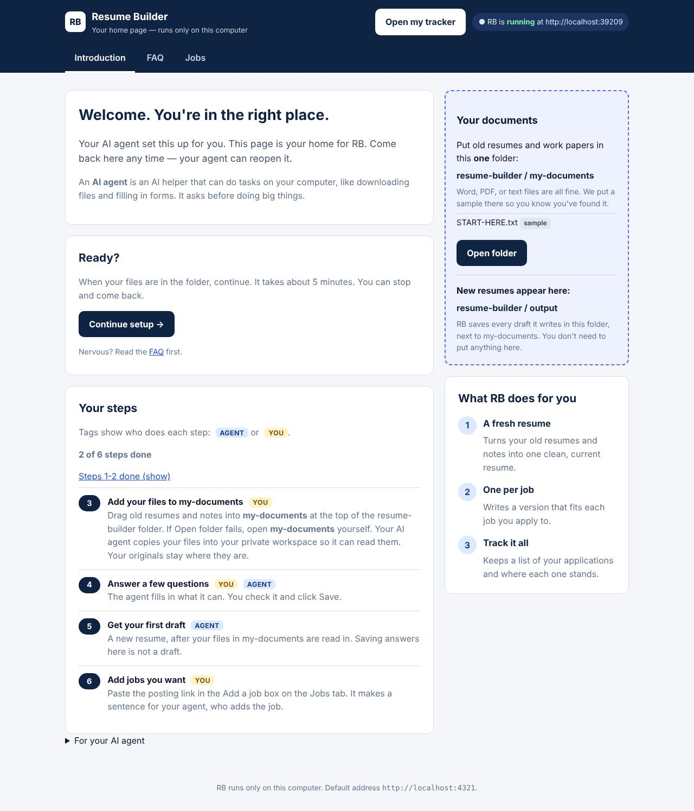

The agent copies the file into the private workspace and reads it in. The resume becomes 29 pieces of evidence, one per bullet, each with an id. Everything the tool later says about the person has to trace back to one of these pieces.

## 2. A few answers

The person (or their agent, from the resume) fills in a short form. Only the goal is required. Deal breakers and salary have a single "Skip this" box.

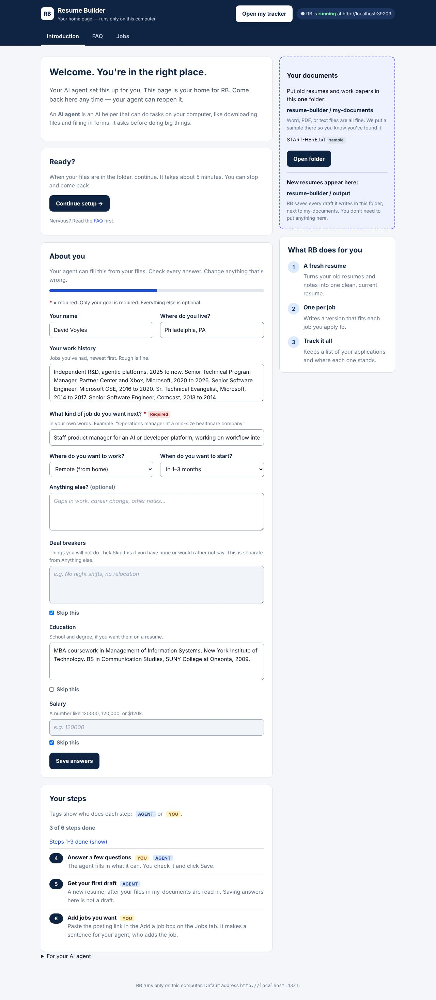

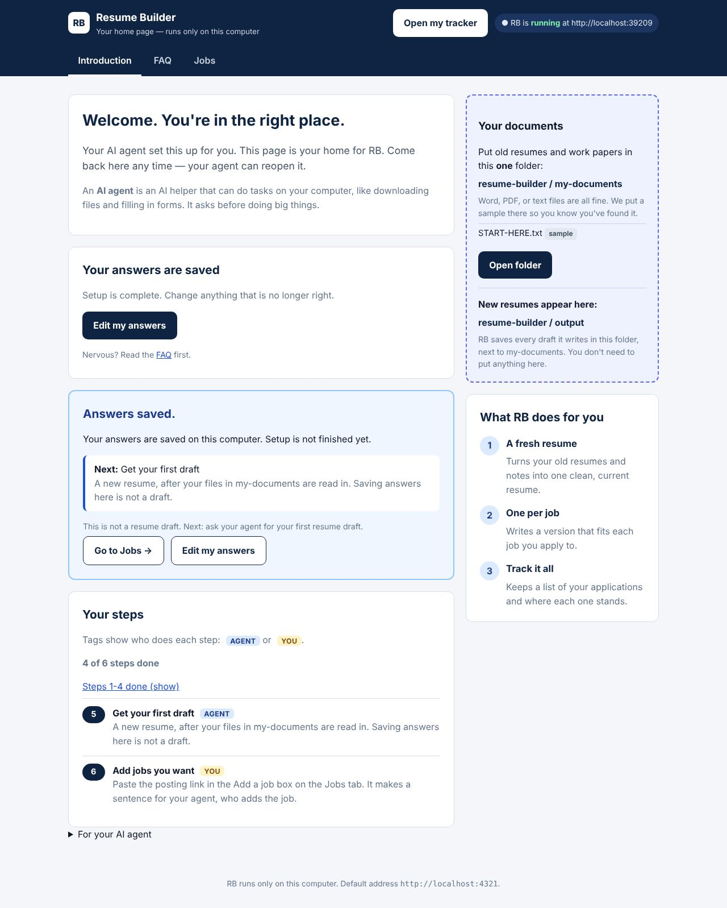

## 3. Find jobs that fit

A web search against this resume found a shortlist of roles. The owner then picked three and saved the pages. The posting text and an offline screenshot of each are kept in the repo, so the demo still works after the pages come down.

| Job | Snapshot | How close the fit is |
| --- | --- | --- |
| JPMorgan Chase, Lead Technical Program Manager | [text](../../examples/personas/owner/postings/jpmc-lead-technical-program-manager.md), [screenshot](../../examples/personas/owner/postings/jpmc-lead-technical-program-manager.jpg) | Closest |
| Bentley Systems, Senior Principal Engineer, Developer Platform | [text](../../examples/personas/owner/postings/bentley-senior-principal-engineer-developer-platform.md), [screenshot](../../examples/personas/owner/postings/bentley-senior-principal-engineer-developer-platform.jpg) | Strong theme, real gaps |
| Deloitte, Lead Forward Deployed Engineer, Frontier GenAI | [text](../../examples/personas/owner/postings/deloitte-lead-fde-frontier-genai.md), [screenshot](../../examples/personas/owner/postings/deloitte-lead-fde-frontier-genai.jpg) | Stretch, kept on purpose |

[`JOBS.md`](../../examples/personas/owner/JOBS.md) lists, for each job, what the resume supports and what it does not.

To add a job from the page, the person pastes the link into the Add a job box. The page writes a sentence for their agent and saves the request. Nothing is fetched or sent.

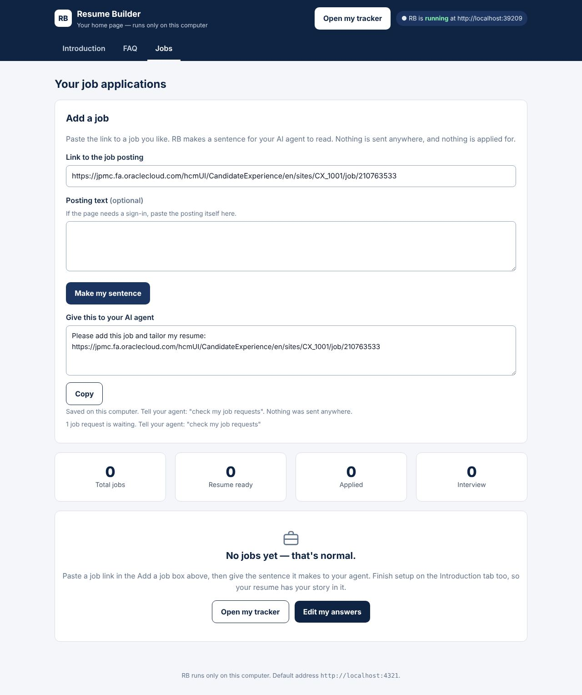

## 4. A resume built for each job

For each posting the tool saves the posting, pulls out the keywords, and builds a one-page resume from the person's own evidence. Then it says what it did.

The home page now shows the resume is ready, with links to the resume, its report and the tracker.

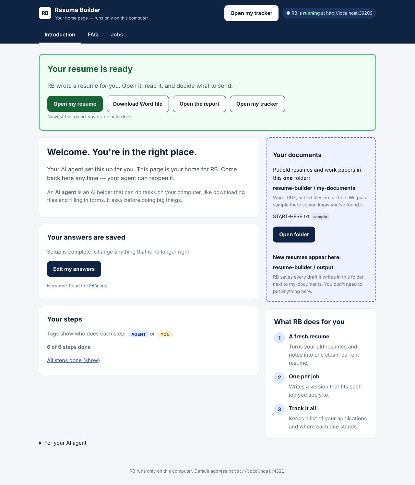

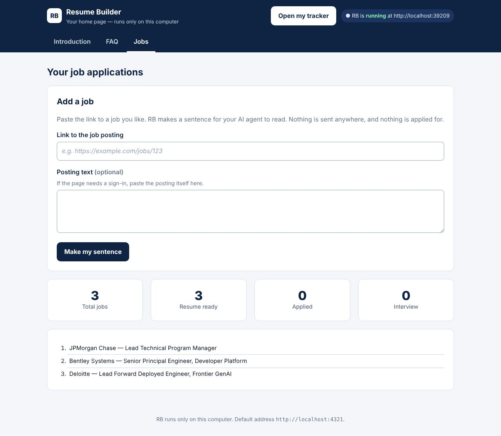

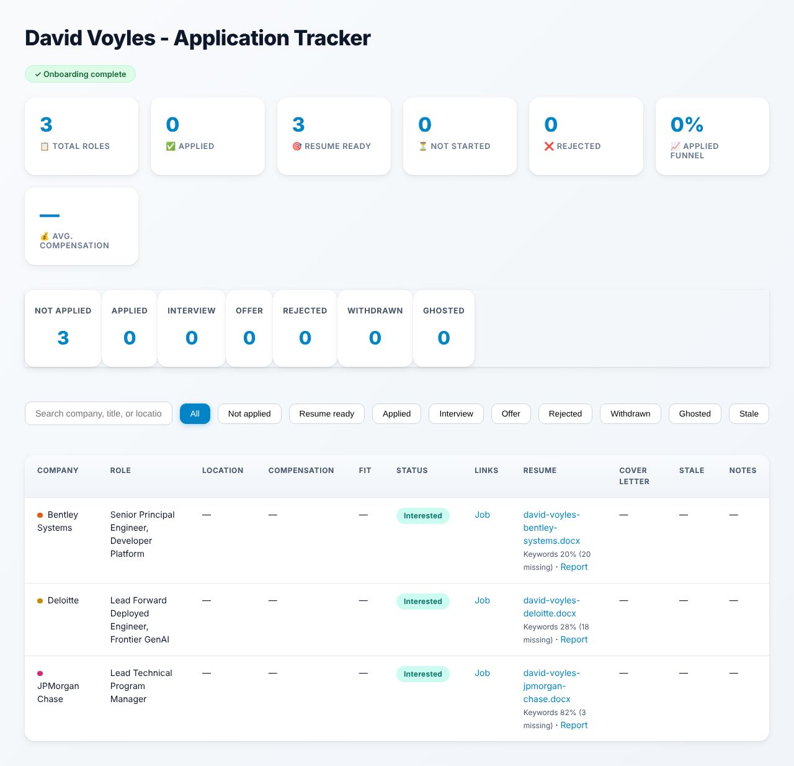

The tailored resumes (JPMorgan Chase first, then Bentley, then Deloitte). Each fits on one page, and each uses only what the original resume says.

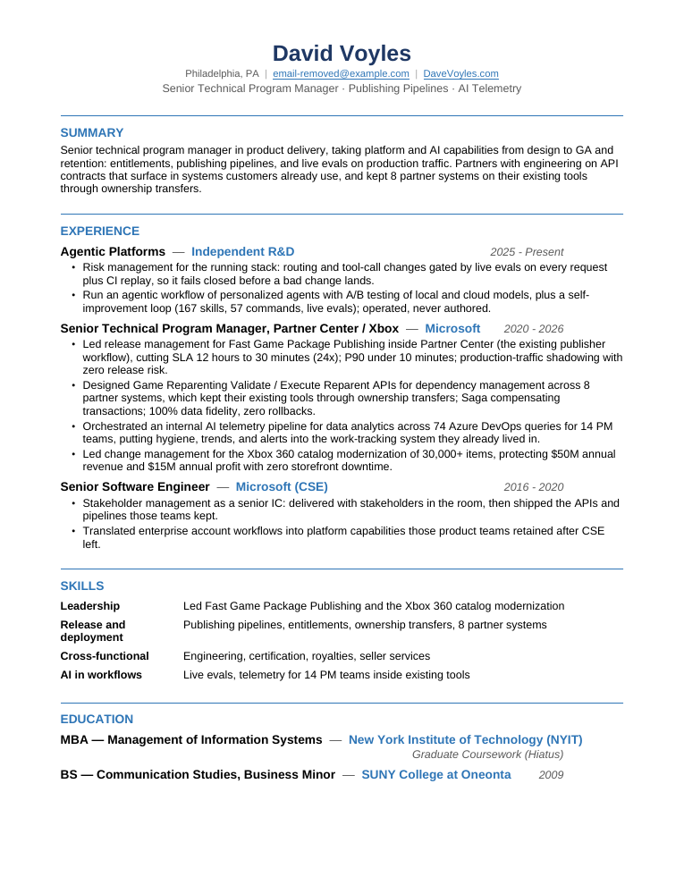

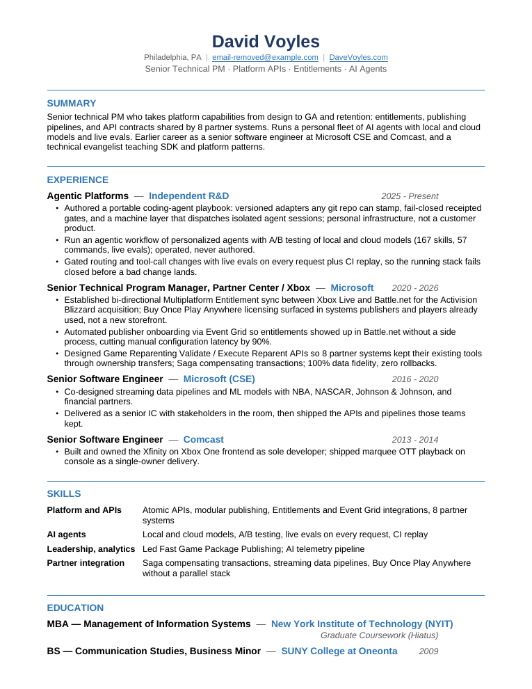

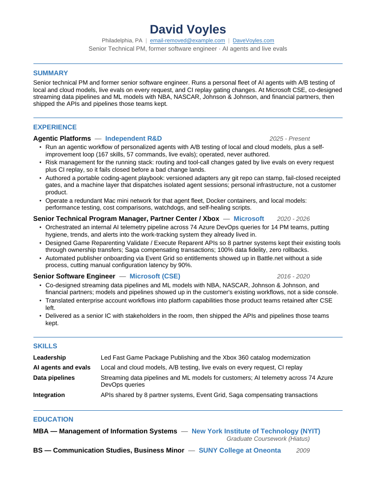

## 5. The proof it was tailored

Each resume comes with a report in plain words. It shows the person's general resume next to the tailored one, why each edit was made and which note or resume line backs it, what was left out, and how many of the posting's keywords the resume now covers.

| Role | Keywords covered, general resume | Keywords covered, tailored |
| --- | --- | --- |
| JPMorgan Chase | 1 of 15 (7%) | 12 of 15 (80%) |
| Bentley | 3 of 25 (12%) | 5 of 25 (20%) |
| Deloitte | 5 of 25 (20%) | 7 of 25 (28%) |

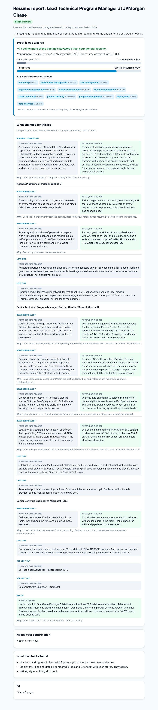

The other two reports: [Bentley](images/09-report-bentley.jpg) and [Deloitte](images/10-report-deloitte.jpg).

## 6. When the resume says it in other words

This is the step that moved JPMorgan Chase from 20% to 80%.

The posting asked for things like release management and dependency management. The resume never uses those words, but it has lines that plausibly show them. The first version of the tool said "no proof" for all of them. Now it shows the closest lines from the person's own record and asks. It never adds anything on its own.

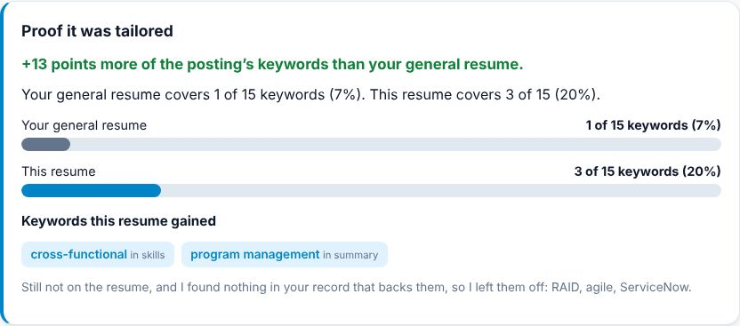

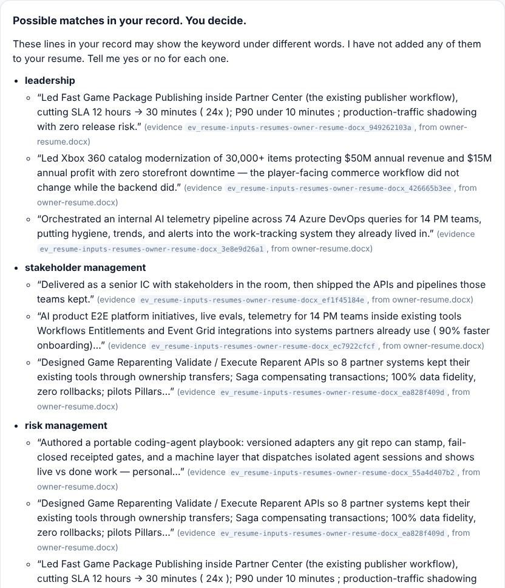

The owner's answer was: all nine, and none of RAID, agile or ServiceNow. That answer is saved as a note in the owner's own words ([`owner-confirmations.md`](../../examples/personas/owner/inputs/notes/owner-confirmations.md)), with the resume line behind each yes. The three declined keywords stay off every resume, and a check in the test suite fails if one appears.

## What is still weak

- **Rewording is light.** Several bullets just add the posting's term ("Led release management for…"). That is honest, because the owner confirmed it, but it reads a little keyword-inserted.
- **The stretch roles barely move.** Bentley and Deloitte gain two keywords each, both from a skills row. The real requirements (API gateway, OAuth, RAG, named model platforms and so on) are not on the resume, so they stay on the do-not-claim list instead of being invented.
- **Keyword percent is a rough guide.** Deloitte's 28% comes from generic words (AI, cloud, API). It does not mean Deloitte is a closer fit than Bentley.
- **Possible matches are only as good as the wording.** The first suggestion is usually right. The second and third are sometimes weak.
- **The screenshots of the saved job pages** show the saved copies, which lost some styling when they were saved. One has a person's photo, so that screenshot is cropped below it.

## Rules this demo follows

- The resume is the owner's own, shared with permission. The email is scrubbed and a test guards it. Do not add anyone else's real resume.
- The job postings are public pages kept for illustration, with their source links. Remove one if its owner asks.
- Nothing in the repo applies for a job.
